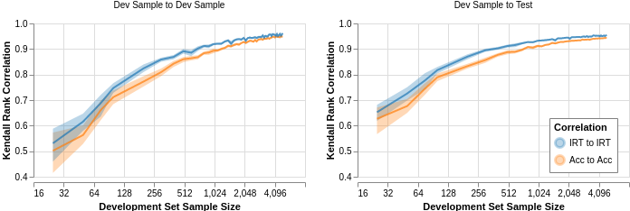

# Evaluation Examples Are Not Equally Informative: How Should That Change NLP Leaderboards?

This repository accompanies our ACL 2021 paper [Evaluation Examples Are Not Equally Informative: How Should That Change NLP Leaderboards?]()

The code here includes what is needed to reproduce those results as well additional work that did not make it into the publication.
Eventually, our goal is that this code provides a re-usable implementation of IRT models geared towards use in NLP leaderboards.

NOTE: There is one set of results that will not be publicly reproducible, namely those that require instance level scores on the SQuAD test set.
To maintain the integrity of the benchmark task, we cannot release this data.

## Running Our Code

We support (at least) two use cases with this code:

1. (Part of a) Full reproduction of our experimental results from scratch
2. A way to quickly run our visualizations without rerunning everything from scratch

For (1), continue reading these instructions, for (2) skip to the bottom.

Our code is broken into two repositories: (1) this repository and (2) the [repository with the LaTeX source code of our paper](https://github.com/entilzha/publications). Roughly, this code encompasses most of the heavy lifting (e.g., running models), but is not mainly responsible for generating the tables and plots in the paper. Instead, this code produces data in a folder called `data` which is then used by the `figures.py` file in the paper source code to generate all relevant figures and statistics.

## Installation

### Installation (required)

- Install Anaconda python
- Create an environment like `conda create -n leaderboard python=3.8`
- Install [Python Poetry](python-poetry.org/) then run `conda activate leaderboard` followed by `poetry install`
- Install Altair dependencies with `conda install -c conda-forge vega-cli vega-lite-cli`
- Install Vowpal Wabbit https://github.com/VowpalWabbit/vowpal_wabbit/

When running project code, be sure to source the conda environment with `conda activate leaderboard` first.

### Installation (frontend, optional)

Separate from our ACL paper, for a course project we developed a proof of concept leaderboard website at [leaderboard.pedro.ai](https://leaderboard.pedro.ai). These instructions explain how to install the dependencies for this. Note: this is different from the UI discussed in the ACL paper.

The frontend is written in typescript + react + d3/vega + materialui.
To run the frontend

1. Install `yarn`
2. `cd frontend`
3. `yarn install`
4. So that the backend and frontend can talk to each other, we use [Caddy](https://caddyserver.com).

## Data

All the data used in our experiments can be downloaded or generated using the instructions below.
The one exception to this are instance-level test scores of SQuAD models, which we cannot release.

### Download Data

If you only need to run our visualizations or the [paper generation code](https://github.com/entilzha/publications), follow these instructions to download a copy of our data.

There are three versions of our data, of decreasing sizes, download one that matches your use case.

- Full data, decompressed 20-25GB: `wget https://obj.umiacs.umd.edu/acl2021-leaderboard/leaderboard-data-all.tar.gz`
- Data minus linear models, decompressed 6GB: `wget https://obj.umiacs.umd.edu/acl2021-leaderboard/leaderboard-data-minus-linear.tar.gz`
- Only IRT related models/data, decompressed 1GB: `wget https://obj.umiacs.umd.edu/acl2021-leaderboard/leaderboard-data-only-irt.tar.gz`

If this repository is cloned to `irt-leaderboard`, you should save the `tar.gz` file to `irt-leaderboard.tar.gz`.
Then, run `tar xzvf irt-leaderboard.tar.gz` which will decompress the tar into `data/`.

If data already exists in `data/`, then you should decompress in a different directory and use a command like `rclone copy other-dir/data irt-leaderboard/data` to copy files (this will override any duplicate files).

### Creating Data from Scratch

To reproduce our results "from scratch," follow these instructions.
When complete, this is equivalent to having followed the "Download Data" section.

Broadly, this is broken into two steps:

1. Downloading SQuAD predictions from [codalab.org](https://codalab.org)
2. Running our data pipeline

#### Downloading SQuAD predictions

Before anything, you should download a copy of the [SQuAD development set](https://rajpurkar.github.io/SQuAD-explorer/dataset/dev-v2.0.json) and save it to `data/squad/datasets/dev-v2.0.json`.
You'll also need to download the training sets for both datasets and save it in a similar location (see `config.toml` for exact location).

Download the `out-v2.0.json` and `out-v1.0.json` files from https://github.com/rajpurkar/SQuAD-explorer and place them in `data`.
We used the---at the time---latest version of this file, which has likely changed since we ran our experiments.
Specifically, our version has an `updated` timestamp of `1601497446.0011725`.

Some scripts that access codalab are modified versions of the scripts found here: https://github.com/codalab/codalab-worksheets/blob/master/scripts/competitiond.py

To download codalab data, you'll need a codalab.org account.
For convenience, you can set your username/password with environment variables `CODALAB_USERNAME` and `CODALAB_PASSWORD`.

This file is used by `leaderboard/codalab.py` to determine which codalab bundles (predictions) to download.
Specifically, you should run this file to download each submission file to `data/squad/submissions/` and corresponding metadata to `data/squad/submission_metadata.json` + `data/squad/skipped_submissions.json`:

- `leaderboard cl download`

Since these are only the predictions, next you will need to score them like this (saves to `data/squad/submission_predictions.json`):

- `leaderboard cl score-submissions`

#### Creating the Submission Database

For historical reasons (web app), our downstream pipelines read a sqlite database holding all the SQuAD model submissions.

Once you have all the files from previous steps, run this to create the database (`data/explorer.sqlite3`):

- `leaderboard squad init-db --skip-tests`

If your database is in a corrupt state before running the command, you may need to delete the bad database first.

As a sanity check, your database should look like this:

```
❯ litecli data/explorer.sqlite3                                                                                                                   (leaderboard)
Version: 1.6.0
Mail: https://groups.google.com/forum/#!forum/litecli-users
GitHub: https://github.com/dbcli/litecli
data/explorer.sqlite3> .tables
+-------------------+
| name              |
+-------------------+
| examples          |
| predictions       |
| statistical_tests |
| submissions       |
+-------------------+
Time: 0.010s
data/explorer.sqlite3> select count() from examples;
+---------+
| count() |
+---------+
| 11873   |
+---------+
1 row in set
Time: 0.006s
data/explorer.sqlite3> select count() from predictions;
+---------+
| count() |
+---------+
| 1911553 |
+---------+
1 row in set
Time: 0.014s
data/explorer.sqlite3> select count() from statistical_tests;
+---------+
| count() |
+---------+
| 0       |
+---------+
1 row in set
Time: 0.005s
data/explorer.sqlite3> select count() from submissions;
+---------+
| count() |
+---------+
| 161     |
+---------+
1 row in set
Time: 0.006s
```

#### Running Data Pipeline

Our data pipeline is handled by [Luigi](https://github.com/spotify/luigi), a make-like python library.
Like make, it functions by listing a set of [tasks](https://github.com/EntilZha/irt-leaderboard/blob/master/leaderboard/tasks.py) that each have:

- pre-requisitives (`def requires()`)
- run definitions (`def run()`)
- outputs (`def output()`)

The pipeline requires that a few files exist before it will run (dependencies external to the pipeline, hence they inherit from `luigi.ExternalTask`).

- `class Database`: `data/explorer.sqlite3`
- `class SquadV2`: SQuAD train/dev sets, saved to `data/squad/datasets/train-v1.1.json`, `data/squad/datasets/train-v2.0.json`, and `data/squad/datasets/dev-v2.0.json`
- `class SugawaraFeatures`: SQuAD easy and hard subsets from https://github.com/Alab-NII/mrc-heuristics/tree/master/subsets, saved to `data/squad/datasets/squad-easy-subset.json` and `data/squad/datasets/squad-hard-subset.json`
- `class SquadOutV2`: Previously mentioned `out-v2.0.json` file, saved to `data/squad/out-v2.0.json`
- `class LeaderboardSubmissionPredictions`: Downloaded from codalab, corresponds to `data/squad/submission_predictions.json`

Once these are present, you can run all the experiments using these commands:

- `luigi --module leaderboard.tasks --workers 1 --local-scheduler AllTopicModels`
- `luigi --module leaderboard.tasks --workers 1 --local-scheduler AllIRTEvaluations`
- `luigi --module leaderboard.tasks --workers 1 --local-scheduler AllVWModels`

To dry run these commands, simply change this argument `--workers 0`.
This is helpful to check if all the pre-requisite external data has been downloaded or to check if all the pre-computed data has been downloaded correctly (in which case it should report there are no tasks to run).

#### Running Components of Pipeline

Much of our code is written so that it can either be called as part of the pipeline, or with the CLI `leaderboard` which you can see more about in `leaderboard/main.py` or calling `leaderboard --help`

## Simulations

In our paper, we run several simulations to comparing ranking stability and annotation sampling strategies.
These are not run by the pipeline, but some depend on having run certain pipeline elements first.
We include instructions for running both simulations, but be aware that only the simulations that do not require SQuAD test data will be reproducible to those without that data.
Namely, the main thing that is reproducible is comparing the rankings of two mutually exclusive samples of the development set.

NOTE: Most of these simulations are relatively CPU intensive and take some time to run.

### Ranking Stability Simulation

These instructions reproduce the experiments in Figure 4 that compare the ranking stability of accuracy rankings versus IRT rankings:



Due to the compute intensive nature of this experiment, we ran these experiments in the CLIP lab's CPU compute cluster which uses slurm.
If you do not use slurm, it is still possible to run our experiments, but it will take some adaptation.
Please create a github issue if you have any trouble with this and need pointers.

In the following instructions, `/fs/clip-quiz/entilzha/ranking_stability` refers to the path storing the scripts that slurm eventually runs.
These scripts call `bin/slurm-run-rank-stability.sh` with the appropriate arguments.
An example of what step 1 generates is:

```
# Contents of run.sh
sbatch bin/slurm-run-rank-stability.sh 25 0 /fs/clip-quiz/entilzha/ranking_stability
sbatch bin/slurm-run-rank-stability.sh 25 1 /fs/clip-quiz/entilzha/ranking_stability
sbatch bin/slurm-run-rank-stability.sh 25 2 /fs/clip-quiz/entilzha/ranking_stability
sbatch bin/slurm-run-rank-stability.sh 25 3 /fs/clip-quiz/entilzha/ranking_stability
sbatch bin/slurm-run-rank-stability.sh 25 4 /fs/clip-quiz/entilzha/ranking_stability
sbatch bin/slurm-run-rank-stability.sh 25 5 /fs/clip-quiz/entilzha/ranking_stability
sbatch bin/slurm-run-rank-stability.sh 25 6 /fs/clip-quiz/entilzha/ranking_stability
sbatch bin/slurm-run-rank-stability.sh 25 7 /fs/clip-quiz/entilzha/ranking_stability
sbatch bin/slurm-run-rank-stability.sh 25 8 /fs/clip-quiz/entilzha/ranking_stability
sbatch bin/slurm-run-rank-stability.sh 25 9 /fs/clip-quiz/entilzha/ranking_stability

sbatch bin/slurm-run-rank-stability.sh 50 0 /fs/clip-quiz/entilzha/ranking_stability
sbatch bin/slurm-run-rank-stability.sh 50 1 /fs/clip-quiz/entilzha/ranking_stability
sbatch bin/slurm-run-rank-stability.sh 50 2 /fs/clip-quiz/entilzha/ranking_stability
sbatch bin/slurm-run-rank-stability.sh 50 3 /fs/clip-quiz/entilzha/ranking_stability
sbatch bin/slurm-run-rank-stability.sh 50 4 /fs/clip-quiz/entilzha/ranking_stability
sbatch bin/slurm-run-rank-stability.sh 50 5 /fs/clip-quiz/entilzha/ranking_stability
sbatch bin/slurm-run-rank-stability.sh 50 6 /fs/clip-quiz/entilzha/ranking_stability
sbatch bin/slurm-run-rank-stability.sh 50 7 /fs/clip-quiz/entilzha/ranking_stability
sbatch bin/slurm-run-rank-stability.sh 50 8 /fs/clip-quiz/entilzha/ranking_stability
sbatch bin/slurm-run-rank-stability.sh 50 9 /fs/clip-quiz/entilzha/ranking_stability

sbatch bin/slurm-run-rank-stability.sh 75 0 /fs/clip-quiz/entilzha/ranking_stability
sbatch bin/slurm-run-rank-stability.sh 75 1 /fs/clip-quiz/entilzha/ranking_stability
sbatch bin/slurm-run-rank-stability.sh 75 2 /fs/clip-quiz/entilzha/ranking_stability
sbatch bin/slurm-run-rank-stability.sh 75 3 /fs/clip-quiz/entilzha/ranking_stability
sbatch bin/slurm-run-rank-stability.sh 75 4 /fs/clip-quiz/entilzha/ranking_stability
sbatch bin/slurm-run-rank-stability.sh 75 5 /fs/clip-quiz/entilzha/ranking_stability
sbatch bin/slurm-run-rank-stability.sh 75 6 /fs/clip-quiz/entilzha/ranking_stability
sbatch bin/slurm-run-rank-stability.sh 75 7 /fs/clip-quiz/entilzha/ranking_stability
sbatch bin/slurm-run-rank-stability.sh 75 8 /fs/clip-quiz/entilzha/ranking_stability
sbatch bin/slurm-run-rank-stability.sh 75 9 /fs/clip-quiz/entilzha/ranking_stability
...

# Contents of config.json
{"fold": "dev", "irt_type": "3PL"}
```

In our experiments, we ran `leaderboard rank_stability configure` twice.
The first created simulations of size 25, 50, and 75 to cover lower sample sizes well.
The second created more spaced out simulations from 100 to 5000 in steps of 100.

1. Configure the simulation: `leaderboard rank_stability configure dev 3PL /fs/clip-quiz/entilzha/ranking_stability`
2. Run the simulation: `sbatch /fs/clip-quiz/entilzha/ranking_stability/run.sh`
3. Create the plot `leaderboard plot --plot stability`

### Cold Start Reliability Simulation

To run the cold start reliability simulation, run `python leaderboard/cat_sampling_stability.py`.

## Supplying Data to Publications Repository

As previously mentioned, we break our source code into two components: (1) the experimental code and plotting code heavily integrated into experimental code and (2) LaTeX source code and the rest of our plotting code.

Once you have run the experiments (or downloaded the data), the best way to link the two repositories up is by creating a symbolic link.
Assuming the two repositories are at `~/code/publications` and `~/code/irt-leaderboard`, run:

```
$ cd publications
$ mkdir 2021_acl_leaderboard/auto_data
$ ln -s ~/code/irt-leaderboard/data ~/code/publications/auto_data/data
```

## Quick Start: Running Visualizations

To run our visualization demo:

1. TODO: Download the data
2. Run `conda activate leaderboard`
3. Run `streamlit run leaderboard/visualize.py`

### Internal to UMD

To save data to the public bucket, use this command:

```bash
$ # To full sync
$ rclone sync  data/ obj:acl2021-leaderboard/data/
$ # To ignore the heavy VW files
$ rclone --checksum --exclude-from rclone-exclude.txt sync  data/ obj:acl2021-leaderboard/data/
```

Where `obj` refers to an rclone key, with a configuration like below, with keys set appropriately:

```
[obj]
type = s3
provider = Other
env_auth = false
access_key_id = CHANGEME
secret_access_key = CHANGEME
endpoint = http://obj.umiacs.umd.edu
```

Similar commands can also be used to sync in the opposite direction.

To generate the tarfiles:

- all the data: `tar czvf` the data
- minus linear: delete `data/linear` then `tar czvf`
- only irt: delete `data/linear`, `data/simulations`, `data/mlqa`, and `data/topic-model` then `tar czvf`

# Additional Instructions

Not all our experiments made it into the paper.
Instructions below pertain to those

## Running the Frontend/Backend for leaderboard.pedro.ai

For a course project (before working on our paper), we prototyped the leaderboard interface at leaderboard.pedro.ai (different from the demo in our paper).
To run this, follow the instructions below
To run the frontend and backend, in separate terminals run:

- Reverse proxy: `caddy start`
- Frontend: `cd frontend` then `yarn start`
- Backend: `poetry run uvicorn --reload leaderboard.www.app:app`
- Yarn will open `localhost:3000`, but you need to instead navigate to `localhost:2000` which is the address the caddy proxy uses

## Rerun Squad with MLQA Data

Although we used the scores of test examples, we cannot release this.
An alternative to this challenge is to use MLQA which is in the same format as SQuAD.
To do this, we need to replicate a similar process that the Squad organizers use to rerun the submitted models on an alternative test set; this section documents this process.
This said, this did not make it into our paper since many models we tried did not successfully run, got stuck while running, or we otherwise had other technical problems.
We leave these instructions/this idea here in case an enterprising undergraduate/graduate student is interested in making this work.

Squad Scripts

- Leaderboard: https://github.com/rajpurkar/SQuAD-explorer
- Competition Update Script: https://github.com/codalab/codalab-worksheets/blob/master/scripts/competitiond.py

Bundle IDs for MLQA data

- Worksheet: https://worksheets.codalab.org/worksheets/0xf5b78f83e1a74d4ea8226b93d4d1198e
- Dev data: https://worksheets.codalab.org/bundles/0x08e323d571a54324bf43674df1f449db
- Test data: https://worksheets.codalab.org/bundles/0x580bbda6871c45ffb0b12ce38600f12d

## Distributions Predictions

Early in the project we began with only five models, these are leftover from this.

For example, to show some distribution information of bert/albert/xlnet/bidaf predictions, run this

```python
$ python leaderboard/main.py squad dist bert albert xlnet bidaf
2020-09-29 10:05:15,966 - INFO - leaderboard.analysis.squad -                         qid   model  correct    label
0  56ddde6b9a695914005b9628    bert        1  correct
1  56ddde6b9a695914005b9628  albert        1  correct
2  56ddde6b9a695914005b9628   xlnet        1  correct
3  56ddde6b9a695914005b9628   bidaf        1  correct
4  56ddde6b9a695914005b9629    bert        1  correct
2020-09-29 10:05:15,993 - INFO - leaderboard.analysis.squad - model                     albert  bert  bidaf  xlnet
qid
56ddde6b9a695914005b9628       1     1      1      1
56ddde6b9a695914005b9629       1     1      1      1
56ddde6b9a695914005b962a       1     0      1      1
56ddde6b9a695914005b962b       1     0      1      1
56ddde6b9a695914005b962c       1     1      1      1
2020-09-29 10:05:16,013 - INFO - leaderboard.analysis.squad - model     albert      bert     bidaf     xlnet
model
albert  1.000000  0.422579  0.282397  0.530353
bert    0.422579  1.000000  0.384276  0.482060
bidaf   0.282397  0.384276  1.000000  0.301975
xlnet   0.530353  0.482060  0.301975  1.000000
2020-09-29 10:05:16,033 - INFO - leaderboard.analysis.squad -         correct
          count      mean       std  min  25%  50%  75%  max
model
albert  11873.0  0.873747  0.332148  0.0  1.0  1.0  1.0  1.0
bert    11873.0  0.787585  0.409034  0.0  1.0  1.0  1.0  1.0
bidaf   11873.0  0.666470  0.471494  0.0  0.0  1.0  1.0  1.0
xlnet   11873.0  0.866083  0.340578  0.0  1.0  1.0  1.0  1.0
2020-09-29 10:05:16,045 - INFO - leaderboard.analysis.squad -          correct
            kurt      skew
model
albert  3.066906 -2.250864
bert   -0.022029 -1.406405
bidaf  -1.501452 -0.706258
xlnet   2.623530 -2.150137
```


# License

The majority of irt-leaderboard is licensed under CC-BY-NC, however portions of the project are available under separate license terms:

* https://github.com/nd-ball/py-irt, https://github.com/rajpurkar/SQuAD-explorer, and leaderboard/squad_eval_v2.py are licensed under the MIT license;
* https://github.com/facebookresearch/irt-leaderboard/blob/master/bin/mrqa_official_eval.py based on https://github.com/mrqa/MRQA-Shared-Task-2019 is licensed under the MIT license
* https://github.com/codalab/codalab-worksheets/blob/master/scripts/competitiond.py, https://worksheets.codalab.org/worksheets/0x8212d84ca41c4150b555a075b19ccc05/, and https://worksheets.codalab.org/worksheets/0xbe2859a20b9e41d2a2b63ea11bd97740 are licensed under the Apache 2.0 license;
* license information for https://github.com/VowpalWabbit/vowpal_wabbit/blob/master/utl/vw-hyperopt.py is available at https://github.com/VowpalWabbit/vowpal_wabbit/blob/master/LICENSE.
* The [1Pl](https://github.com/facebookresearch/irt-leaderboard/blob/master/leaderboard/irt/stan/1PL.stan) and [2PL](https://github.com/facebookresearch/irt-leaderboard/blob/master/leaderboard/irt/stan/2PL.stan) Stan models are licensed under the BSD three clause from https://github.com/stan-dev/docs/blob/master/LICENSE
